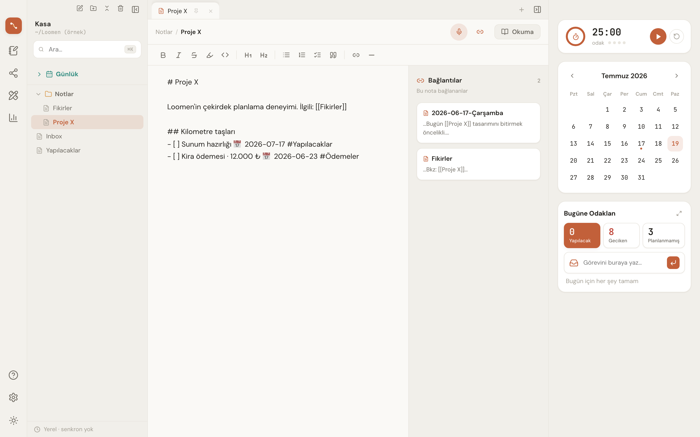
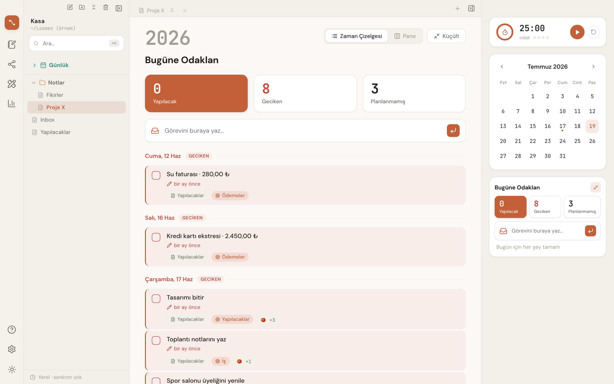
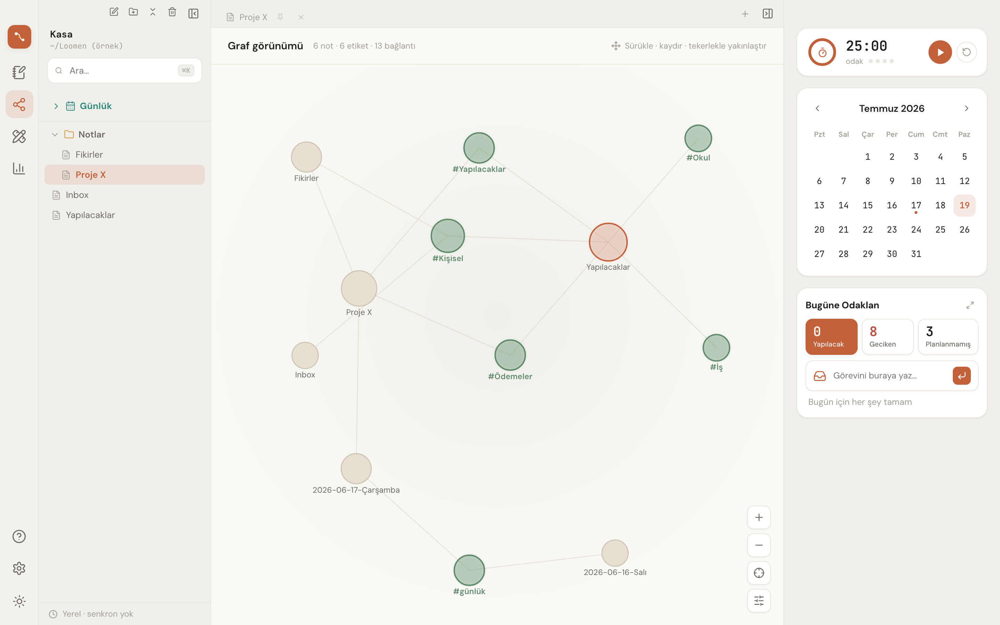

**[Türkçe](README.md)** · **[English](README.en.md)** · العربية

# Loomen

**تطبيق لإدارة المعرفة الشخصية (PKM) يعمل محليًا بالكامل** — يحفظ ملاحظاتك في ملفات `.md` عادية،
ويأتي مزوَّدًا بمخطِّط يومي وتقويم ومؤقّت بومودورو مدمجة.

لا خادم، ولا حساب، ولا اشتراك. ملاحظاتك تبقى على قرصك، في مجلدك أنت، وبصيغة مفتوحة.

- **المنصّات:** macOS · Windows · Linux · iOS · Android (Tauri 2.0)
- **الرخصة:** [PolyForm Noncommercial 1.0.0](LICENSE) — الاستخدام الشخصي مجاني، والاستخدام التجاري محظور
- **الحالة:** قيد التطوير النشط (`v0.1.0`) — لم يصدر إصدار منشور بعد
- **النطاق:** loomen.org

---



<table>
<tr>
<td width="50%"></td>
<td width="50%"></td>
</tr>
<tr>
<td align="center"><em>المخطِّط — المهام والخط الزمني وبومودورو</em></td>
<td align="center"><em>الرسم البياني — الروابط بين الملاحظات والوسوم</em></td>
</tr>
</table>

---

## لماذا Loomen؟

معظم تطبيقات الملاحظات إمّا تحفظ ملاحظاتك على خوادمها الخاصة، أو تحبسها في صيغة مغلقة، أو تترك
جانب التخطيط لتطبيق منفصل. يرفض Loomen هذه الأمور الثلاثة معًا:

- **ملكية البيانات لك.** الملاحظات بصيغة Markdown عادية مع YAML frontmatter. احذف التطبيق وستبقى ملاحظاتك.
- **لا حاجة للإنترنت.** لا تتصل أيٌّ من الوظائف الأساسية بالشبكة.
- **التخطيط جزء من تدوين الملاحظات.** المهام والتقويم وبومودورو ليست تطبيقًا منفصلًا، بل تقع بجوار ملاحظاتك.

## المزايا

### الملاحظات والمحرّر
- محرّر Markdown مبني على CodeMirror 6 مع **معاينة مباشرة**
- **ربط ثنائي الاتجاه** — `[[wiki-link]]` ولوحة الروابط الخلفية (backlinks)
- أداة تحرير الجداول، وشريط أدوات التنسيق، وقائمة النقر بالزر الأيمن
- وضع المحرّر النصي البسيط (لمن لا يرغب في صياغة Markdown)
- بحث في النص الكامل
- **الملاحظة اليومية** — تُنشأ تلقائيًا من قالب مرتبط بالتاريخ
- **سلة المهملات** — تُحفظ الملاحظات المحذوفة 30 يومًا ويمكن استرجاعها

### المخطِّط والتقويم وبومودورو
- عرض الخطة اليومية، ولوحة المهام، والخط الزمني
- بطاقة التقويم، وجدول الأعمال المصغّر، وبطاقات الإحصائيات
- تفاصيل المهمة: مهام فرعية، وتكرار، وملاحظات
- إضافة سريعة للمهام
- مؤقّت **بومودورو** مدمج

### التصوّر المرئي
- **عرض الرسم البياني** — رسم بياني للروابط بين الملاحظات (d3-force)
- **الرسم** — تكامل مع Excalidraw
- شاشة التقارير

### الصوت
- **تسجيل صوتي** داخل التطبيق (VoiceRecorder) بترميز WAV و FLAC
- مشغّل صوت مدمج داخل الملاحظات

### المزامنة (اختيارية)
**لا نملك** خادم مزامنة خاصًا بنا. وبما أن الخزنة عبارة عن ملفات `.md` عادية، فيمكن مزامنتها عبر
iCloud أو Syncthing أو Git. إضافةً إلى ذلك، من داخل التطبيق:
- **مزامنة GitHub** — عبر OAuth Device Flow *(المزامنة القائمة على git متاحة على سطح المكتب فقط)*
- **تقويم Google** — عبر OAuth 2.0 loopback + PKCE

### متعدد اللغات
التركية · الإنجليزية · **العربية (دعم RTL من الدرجة الأولى)**. تتوسّع البنية إلى 20 لغة دون تغيير الشيفرة.

---

## التطوير

**المتطلبات:** Node.js 20+، وRust (الإصدار المستقر)، و[متطلبات Tauri المسبقة](https://tauri.app/start/prerequisites/)
الخاصة بمنصّتك.

```bash
git clone https://github.com/ofarukerol/Loomen.git
cd Loomen
npm install
cp .env.example .env      # للتكاملات (اختياري، انظر أدناه)
npm run tauri dev
```

أوامر أخرى:

```bash
npm run build             # فحص الأنواع بـ tsc + بناء Vite
npm run tauri build       # حزمة سطح مكتب قابلة للتوزيع
```

### الإعداد

يتطلب تكاملا GitHub وتقويم Google عميل OAuth خاصًا بك. خطوات الإعداد موثّقة تفصيليًا في ملف
`.env.example` — انسخه إلى `.env` واملأ القيم. **هذان التكاملان اختياريان؛ ويعمل التطبيق بكامل
وظائفه من دونهما.**

### أمور ينبغي معرفتها

- إذا عدّلت `src-tauri/capabilities/` أو أي جزء من جانب Rust، فأعد **تشغيل** التطبيق —
  فهذه الملفات تُترجَم داخل الملف الثنائي ولا يلتقطها HMR.
- استخدم **أحداث المؤشّر (pointer events)** في السحب والإفلات؛ إذ لا يدعم WKWebView في Tauri
  آلية HTML5 DnD الأصلية بشكل موثوق.
- المجلد `src-tauri/gen/` غير مُدرج في نظام التحكم بالإصدارات؛ يُولَّد عبر
  `tauri ios init` / `tauri android init`.

---

## البنية

**الواجهة الأمامية:** React 19 · TypeScript · Zustand · CodeMirror 6 · i18next · Excalidraw · d3-force
**الخلفية (محليًا):** Rust / Tauri 2.0 — نظام الملفات، وOAuth (PKCE)، وGitHub Git Data API

**لا يوجد** أي مكوّن خادم ولا قاعدة بيانات. المصدر الوحيد للحقيقة هو ملفات `.md` على القرص؛
وكل ما في الذاكرة هو ذاكرة تخزين مؤقت.

> ⚠️ يجب أن يلتزم كل تغيير يمسّ محتوى الملاحظات بالقواعد الواردة في
> [`NOTE_SAFETY_RULES.md`](NOTE_SAFETY_RULES.md). كُتبت هذه القواعد بعد حادثة فقدان بيانات حقيقية.

### وثائق التخطيط

توجد متطلبات المنتج وقرارات التصميم ضمن [`docs/planning/`](docs/planning/) —
المواصفات، ونطاق MVP، وتصميم النظام، وحزمة التقنيات، ومعايير القبول، ومواصفات المخطِّط،
وبنية i18n، ونظام التصميم.

---

## المساهمة

طلبات السحب (Pull requests) مرحّب بها. قبل المساهمة، اقرأ [`CONTRIBUTING.md`](CONTRIBUTING.md) —
وقبول [`CLA.md`](CLA.md) (اتفاقية ترخيص المساهم) **إلزامي** ويُفحص تلقائيًا في طلبات السحب.

## الرخصة

[PolyForm Noncommercial 1.0.0](LICENSE) — الاستخدام حرّ لأي غرض شخصي أو تعليمي أو هوايةً أو أي
غرض **غير تجاري**. **يُحظر الاستخدام التجاري.** للحصول على رخصة تجارية، تواصل مع مالك المشروع.

حقوق النشر © 2026 Ömer Faruk Erol
