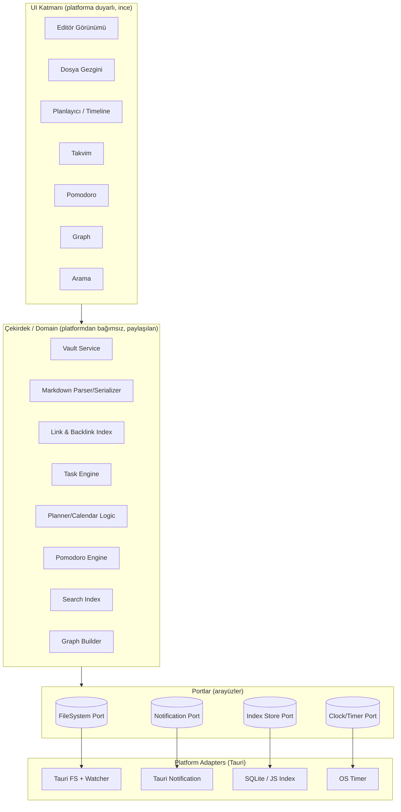
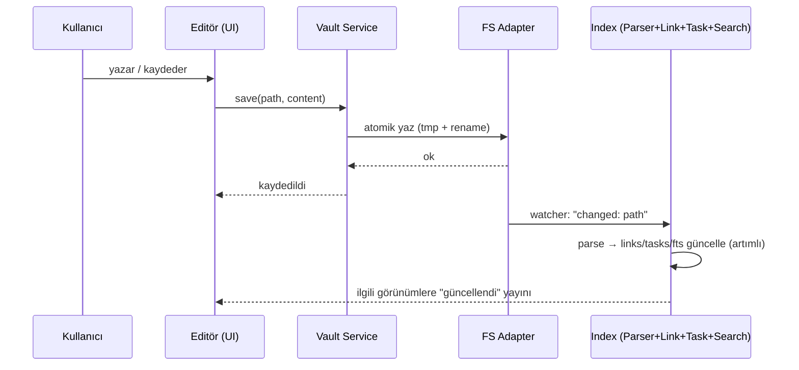
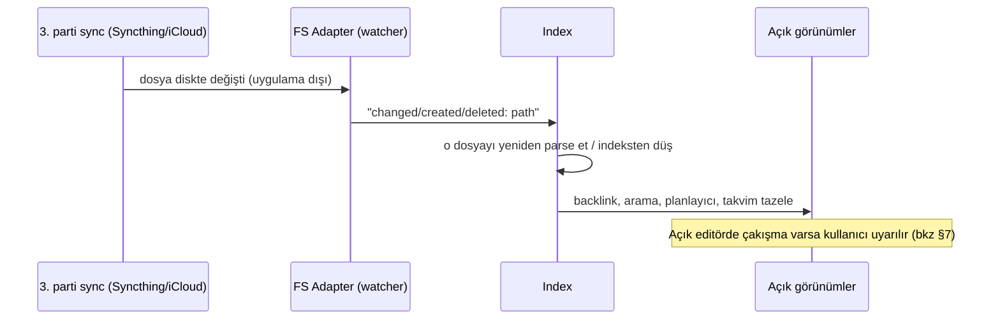
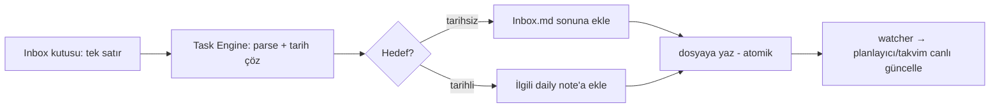

# 03 — System Design (Mühendislik Blueprint'i)

> **Rol:** Senior System Architect
> **Soru:** "MVP'yi en sağlam, en az parçayla, teknoloji-bağımsız nasıl kurarız?"
> **Önceki:** [`02-mvp-scope.md`](02-mvp-scope.md) · **Sonraki:** [`04-tech-stack.md`](04-tech-stack.md)

Bu doküman somut kütüphane seçmeden (o `04`'te) sistemin **katmanlarını, veri modelini ve
akışlarını** tanımlar. Tek geliştirici kısıtı (NFR-14) gereği ilke: **az hareketli parça, net
sınırlar, türetilen her şey yeniden üretilebilir.**

---

## 1. En riskli mimari alan (önce bununla yüzleş)

> **Veri tutarlılığı, harici dosya değişiklikleri karşısında.**

Vault düz `.md` dosyalarıdır ve **3. parti sync (iCloud/Syncthing/Git) bu dosyaları uygulamanın
arkasından değiştirir.** Aynı anda uygulamanın da bir in-memory/SQLite indeksi vardır. Risk:
indeks ile disk **birbirinden kopar** → yanlış arama sonucu, hayalet backlink, kaybolmuş görev.

**Bu riski yöneten ilke (tüm tasarımın çıpası):**
1. **Disk daima kazanır.** `.md` dosyaları tek doğruluk kaynağıdır; indeks yalnızca türetilmiş cache'tir.
2. **File watcher zorunludur.** Dosya sistemi olayları (oluştur/değiştir/sil/taşı) dinlenir ve
   indeks **artımlı** güncellenir.
3. **İndeks her an atılıp yeniden kurulabilir.** Şüphe varsa "reindex". Hiçbir kullanıcı verisi
   yalnızca indekste yaşamaz.
4. **Atomik yazma.** Uygulama yazarken geçici dosya + atomik rename; yarı yazılmış dosya bırakmaz.

---

## 2. Katmanlı Mimari (Clean / Hexagonal esinli)

UI ile iş mantığını ayırmak, masaüstü+mobil kod paylaşımını (NFR-15) mümkün kılar. **Çekirdek
mantık platformdan habersizdir**; platform yetenekleri (FS, bildirim) port/adapter ile enjekte edilir.



**Katman kuralları:**
- UI → Çekirdek'i çağırır; **Çekirdek UI'ı bilmez**.
- Çekirdek → yalnızca **portları** (arayüz) bilir; somut Tauri API'lerini bilmez. Bu sayede aynı
  çekirdek hem masaüstü hem mobilde, hatta test ortamında (sahte adapter) çalışır.
- Adapter'lar Tauri'ye özgü kodu izole eder → mobil/masaüstü farkları burada kalır.

---

## 3. Veri Modeli

### 3.1 Vault (disk üzerindeki gerçek)

```
MyVault/
├── .loomen/                 # uygulamaya özel (sync'ten hariç tutulabilir)
│   ├── index.sqlite           # türetilmiş cache (silinse yeniden kurulur)
│   ├── workspace.json         # açık sekmeler, son durum
│   └── settings.json          # vault-yerel ayarlar
├── .trash/                    # geri-alınabilir silme
├── Daily/                     # daily notlar  (2026-06-14.md ...)
├── Notlar/
│   ├── Fikirler.md
│   └── Proje X.md
└── attachments/               # görseller/dosyalar
```

> `.loomen/` ve `.trash/` kullanıcıya 3. parti sync'te hariç tutma önerisi olarak belgelenir
> (örn. `.stignore` / `.gitignore`), çünkü cache'in cihazlar arası taşınmasına gerek yoktur.

### 3.2 Not dosyası (Markdown + frontmatter)

```markdown
---
title: Proje X
tags: [proje, aktif]
created: 2026-06-14
---

# Proje X

İlgili: [[Fikirler]]

- [ ] Tasarımı bitir 📅 2026-06-20 ⏳ 2026-06-18 🔼
- [x] Toplantı notlarını yaz ✅ 2026-06-13
```

### 3.3 Görev (Task) modeli — Obsidian Tasks uyumlu

Bir görev **bir markdown satırıdır**; uygulama onu yapılandırılmış nesneye **parse eder** ve
değişince **aynı satıra geri yazar** (round-trip kayıpsız — kritik).

| Alan | Markdown işareti | Örnek | Not |
|------|------------------|-------|-----|
| status | `- [ ]` / `- [x]` | açık / tamamlandı | `/` (in-progress) gibi özel durumlar Could |
| description | (metin) | "Tasarımı bitir" | — |
| due | 📅 | `📅 2026-06-20` | planlayıcı/takvimin ana tarihi |
| scheduled | ⏳ | `⏳ 2026-06-18` | "ne zaman çalışılacak" |
| start | 🛫 | `🛫 2026-06-15` | — |
| done | ✅ | `✅ 2026-06-13` | tamamlanınca yazılır |
| priority | 🔺🔼🔽 ⏬⏫ | `🔼` | sıralama |
| recurrence | 🔁 | `🔁 every week` | Could (gelişmiş) |
| source | (dosya yolu) | `Daily/2026-06-14.md` | hangi nottan geldiği |

> **Tasarım kararı:** Görevler için **ayrı bir veritabanı tablosu doğruluk kaynağı DEĞİLDİR.**
> SQLite'taki görev tablosu yalnızca hızlı sorgu için **türetilmiş indekstir**; gerçek görev
> daima dosyadaki satırdır. Bu, taşınabilirliği (NFR-9) garanti eder.

### 3.4 İndeks Şeması (türetilmiş cache — `index.sqlite`)

> Bu şema sadece **performans** içindir; her tablo dosyalardan yeniden üretilebilir.

```sql
-- Notlar (dosya meta verisi)
notes(id, path, title, mtime, size, frontmatter_json)

-- Bağlantılar (graph + backlink için)
links(source_path, target_path, type)        -- type: WIKILINK | EMBED | TAG

-- Etiketler
tags(tag, note_path)

-- Görevler (planlayıcı/takvim için türetilmiş)
tasks(id, source_path, line, status, description,
      due, scheduled, start, done, priority, recurrence)

-- Tam metin arama
notes_fts(path, title, body)                  -- FTS5 sanal tablo

-- Pomodoro oturum logu (bu tek tablo gerçek veri sayılabilir; ayrıca daily note'a da yazılır)
pomodoro_sessions(id, task_ref, started_at, ended_at, kind, completed)
```

> **Tek istisna:** Pomodoro oturum geçmişi doğal olarak markdown'da durmaz; bunun için iki yol
> izlenir — (a) özet daily note'a yazılır (taşınabilir), (b) detaylı kayıt `pomodoro_sessions`'ta
> tutulur (istatistik). Karar: **özet daima daily note'a** (kaynak), SQLite hızlı istatistik için.

---

## 4. Çekirdek Bileşenler

| Bileşen | Sorumluluk | Girdi → Çıktı |
|---------|------------|---------------|
| **Vault Service** | Dosya CRUD, çöp kutusu, atomik yazma, watcher olaylarını yayınla | FS Port ↔ dosyalar |
| **Markdown Parser/Serializer** | md ↔ AST; frontmatter; görev satırı parse/serialize | metin ↔ yapı |
| **Link Index** | `[[...]]` ve embed çıkar; backlink haritası; graph kenarları | notlar → links tablosu |
| **Task Engine** | Görev satırlarını topla, parse et, durum/tarih güncelle, dosyaya geri yaz | notlar ↔ tasks |
| **Planner/Calendar Logic** | Görevleri tarihe göre grupla, göreli tarih hesapla, sayaçları (Todo/Overdue/Unplanned) üret, daily note çöz | tasks → görünüm modeli |
| **Pomodoro Engine** | Timer durum makinesi, göreve bağla, oturum logla, bildirim tetikle | Clock/Notification Port |
| **Search Index** | FTS güncelle/sorgula; hızlı dosya açıcı | notlar → sonuçlar |
| **Graph Builder** | links tablosundan düğüm/kenar grafiği üret | links → graph |

---

## 5. Ana Veri Akışları

### 5.1 Not kaydetme → indeks güncelleme



### 5.2 Harici sync ile gelen değişiklik (en kritik akış)



### 5.3 Hızlı görev ekleme (Inbox) → dosyaya yazma



---

## 6. Cross-Platform Stratejisi (masaüstü ↔ mobil)

- **Paylaşılan çekirdek:** Domain + portlar TEK kod tabanında (TypeScript). Masaüstü ve mobil
  **aynı** Vault/Task/Planner/Search mantığını çağırır.
- **İnce platform farkları adapter'larda:**
  - **FS:** masaüstü tam dosya sistemi erişimi; mobilde uygulama-kapsamlı dizin / paylaşımlı klasör
    seçimi (iOS/Android kısıtları). Watcher mobilde sınırlı → uygulama öne gelince **reconcile tara**.
  - **Bildirim:** her iki platformda yerel notification, farklı izin akışları.
  - **Timer (Pomodoro):** mobilde arka plan kısıtı → "bitiş zaman damgası" tabanlı hesap + zamanlanmış
    yerel bildirim (uygulama uykuda olsa bile doğru sonuç).
- **UI uyarlaması:** aynı bileşen mantığı, responsive yerleşim; mobilde graph opsiyonel, kısayollar yok.

---

## 7. Çakışma & Sync Notları (offline-first, çatışmasız politika)

Loomen **kendi sync'ini yapmaz**; ama 3. parti sync'in yaratacağı durumları **zarifçe karşılar**:

| Durum | Davranış |
|-------|----------|
| Uygulama kapalıyken dosya değişti | Açılışta reindex / watcher ile yakala; sorunsuz yansır |
| Açık editör + diskten farklı sürüm geldi | Kullanıcıya uyarı: "Bu dosya diskte değişti — yeniden yükle / benimkini koru". Sessiz ezme **yok** (NFR-5) |
| Syncthing çakışma dosyası (`...sync-conflict...`) | Vault'ta normal not olarak görünür; kullanıcı elle birleştirir (Markdown olduğu için okunabilir) |
| Silinen dosya başka cihazda düzenlenmiş | Sync aracının kararına bırakılır; uygulama yalnızca sonucu yansıtır |

> Çakışma çözümü **dosya düzeyinde, kullanıcı kontrolünde** kalır — bu bilinçli bir sadelik kararıdır
> (kendi merge motorunu yazmak MVP dışı, `02 §1 Won't`).

---

## 8. Güvenlik & Gizlilik (mimari seviye)

- **Ağ yok:** Çekirdek hiçbir uzak uca veri göndermez (NFR-8). Tauri'de ağ izinleri kapalı tutulur.
- **Sandboxing:** Tauri'nin yetenek (capability) sistemi ile yalnızca seçilen vault dizinine FS erişimi.
- **Yerel veri:** Şifreleme MVP dışı; veri kullanıcının disk/OS güvenliğine emanet (belgele).
- **Yıkıcı işlem koruması:** silme → `.trash`; kalıcı silme açık onay (NFR-6).

---

## 9. Teknik Kısıtlar (özet)

- Tek doğruluk kaynağı = disk; indeks daima yeniden üretilebilir.
- Round-trip kayıpsız markdown/görev serileştirme zorunlu.
- Çekirdek platformdan bağımsız; Tauri'ye özgü kod yalnız adapter'larda.
- Mobilde watcher/timer/graph kısıtları kabul edilir ve adapter'larda telafi edilir.
- Tek geliştirici: yeni bir hareketli parça eklemeden önce "bu gerçekten gerekli mi?" sorulur.

---

*Sonraki adım: [`04-tech-stack.md`](04-tech-stack.md) — bu mimariyi gerçekleyecek somut teknolojiler.*
