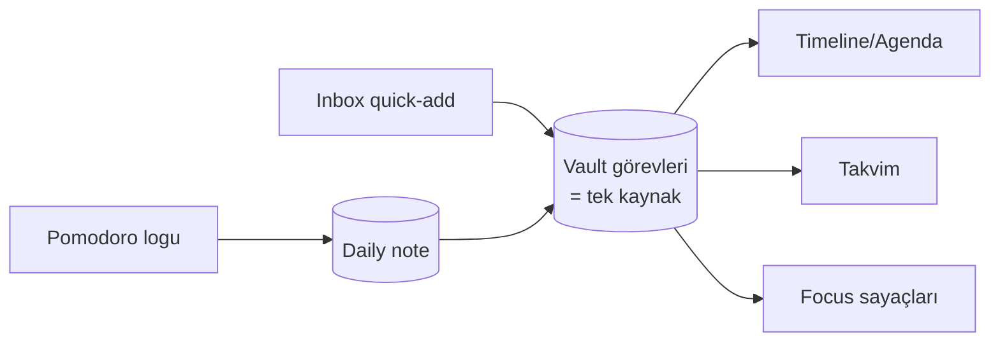
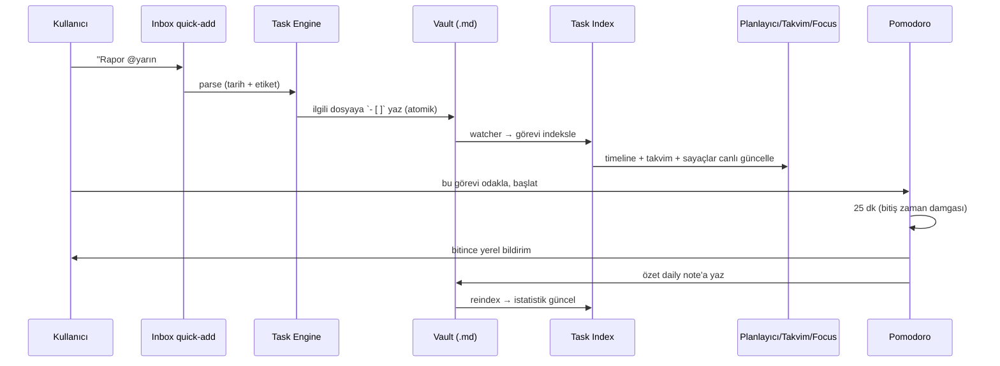

# 06 — Gömülü Planlayıcı + Takvim + Pomodoro (Detay Spec)

> **Rol:** Ürün + Mimari (derinlemesine)
> **Amaç:** Loomen'ı ayırt eden parçayı — ekran görüntüsündeki Obsidian planlama deneyimini —
> birebir spesifiye etmek.
> **Önceki:** [`05-acceptance-criteria.md`](05-acceptance-criteria.md) · **İndeks:** [`00-README.md`](00-README.md)

Bu doküman, kullanıcının paylaştığı **mevcut Obsidian günlük planlama ekranını** (Tasks +
Tasks Timeline + Calendar plugin kombinasyonu) referans alır ve bunu Loomen'a **gömülü, kutudan
çıkar çıkmaz çalışan** bir özellik olarak tasarlar. `01`(FR-19..29), `02`(MVP), `03`(mimari),
`05`(kabul) ile çapraz tutarlıdır.

---

## 1. Ekran Görüntüsü Analizi (referanstan çıkarılan birebir gereksinimler)

Paylaşılan ekranda görülenler ve Loomen karşılıkları:

| Ekrandaki öğe | Açıklama | Loomen karşılığı |
|---------------|----------|--------------------|
| **`2026`** büyük başlık | Aktif yıl/kapsam başlığı | Timeline üst başlığı (yıl/aralık) |
| **`Saturday, Jun 13`** tarih grupları | Görevler güne göre gruplu | `groupByDate` — dikey timeline grupları |
| ⏳ ikon + görev metni | Her görev satırı | Görev satırı bileşeni (durum ikonu + başlık) |
| ✏️ 📅 **"bir gün önce" / "6 gün sonra" / "bir ay sonra"** | Göreli tarih etiketi | `formatRelative` (date-fns, tr-TR) |
| 📄 **`2026-06-12-Cuma>`** | Kaynak not linki | Görevin geldiği dosyaya tıkla-git |
| 🎯 **`Yapılacaklar`** | Görev etiketi/hedef | `#etiket` rozeti |
| **`Focus On Today`** başlığı | Bugün odak bölümü | Sabit üst bölüm |
| **`8 Todo` / `22 Overdue` / `20 Unplanned`** kartları | Canlı sayaçlar | 3 istatistik kartı (tıkla-filtrele) |
| **`New T... 📥 Inbox / Enter your tasks here`** | Hızlı görev ekleme | Inbox quick-add input |
| ↵ (enter) butonu | Görevi ekle | Onay/ekle aksiyonu |
| **Takvim** (kullanıcı talebi) | Aylık takvim ile birleştirme | Calendar görünümü + timeline entegrasyonu |

> **Hedef his:** Kullanıcı uygulamayı açtığında, hiçbir eklenti kurmadan, **tam bu ekranı**
> (timeline + Focus On Today + sayaçlar + Inbox) ve buna bağlı bir **aylık takvimi** görmeli.

---

## 2. Ekran Yerleşimi (Layout)

### 2.1 Masaüstü — "Planlama" çalışma alanı

```
┌────────────┬─────────────────────────────────────┬──────────────────────┐
│            │            2026                      │                      │
│  Dosya     │  ── Focus On Today ──                │     ◀  Haziran 2026  ▶│
│  Gezgini   │  ┌──────┐ ┌────────┐ ┌──────────┐    │   Pzt Sal Çar ... Paz│
│            │  │8 Todo│ │22 Over.│ │20 Unplan.│    │    1   2   3  ...     │
│  Notlar/   │  └──────┘ └────────┘ └──────────┘    │    8   9  10  ... ●   │
│  Daily/    │  [ 📥 Inbox: görev ekle...        ↵ ]│   15  16  17  ...     │
│            │                                      │                      │
│            │  ── Saturday, Jun 13 ──              │  (gün tıkla →        │
│            │  ⏳ Görev metni                      │   daily note +       │
│            │     ✏️📅 bir gün önce               │   o günün görevleri) │
│            │     📄 2026-06-12-Cuma  🎯 Yapılacak │                      │
│            │  ── Saturday, Jun 20 ──              │  ┌── Pomodoro ──┐    │
│            │  ⏳ Görev metni  …                   │  │   25:00       │    │
│            │                                      │  │ ▶ Başlat      │    │
│            │                                      │  │ Görev: ...    │    │
│            │                                      │  └───────────────┘    │
└────────────┴─────────────────────────────────────┴──────────────────────┘
   Sol panel          Orta: Timeline/Agenda            Sağ: Takvim + Pomodoro
```

### 2.2 Mobil — sekmeli/yığılmış

Tek sütun; alt sekme çubuğu: **Planlayıcı · Takvim · Notlar · Pomodoro · Ara**.
Planlayıcı sekmesi = Focus On Today + sayaçlar + Inbox + timeline (dikey kaydırma).
Inbox quick-add mobilin en kritik senaryosudur (Persona C).

---

## 3. Timeline / Agenda Görünümü (FR-19,20)

### 3.1 Davranış
- Tüm vault'taki görevler **tek akışta**, **tarihe (due) göre gruplu** ve kronolojik sıralı.
- Geçmiş ve gelecek aynı listede; "bugün" görsel olarak vurgulanır (referanstaki gibi geçmiş
  ödeme + gelecek ödemeler arka arkaya).
- Boş gün grupları gösterilmez (yalnız görevi olan günler başlık alır).
- **KARAR (B) — performans penceresi:** Timeline varsayılan olarak **"son 30 gün + tüm gelecek"**
  görevlerini gösterir; daha eskisi "daha fazla yükle" ile açılır. **Geciken (Overdue) görevler
  pencereye bakılmaksızın HER ZAMAN görünür** (tarihi ne kadar eski olursa olsun). Pencere boyutu
  ayardan değiştirilebilir.

### 3.2 Görev satırı anatomisi
```
[durum ikonu]  Görev açıklaması
               ✏️📅 <göreli tarih>            (örn. "6 gün sonra")
               📄 <kaynak not>   🎯 <etiket>   (tıkla → nota git / etikete filtrele)
```
- **Durum ikonu:** açık (⏳/☐), tamamlandı (✅), iptal (opsiyonel). Tıkla → tamamla (dosyaya yaz).
- **Göreli tarih:** `date-fns` `formatRelative`/özel — tr-TR: "bir gün önce", "bugün", "yarın",
  "6 gün sonra", "bir ay sonra". Geciken görevde kırmızımsı vurgu.
- **Kaynak not:** görevin bulunduğu dosya; tıkla → o notu aç (ilgili satıra kaydır).
- **Etiket:** görev satırındaki `#etiket`; tıkla → o etikete göre timeline filtrele.

### 3.3 Sıralama & gruplama mantığı
- Birincil: due tarihi. due yoksa scheduled. İkisi de yoksa → **Unplanned** (ayrı bölüm).
- Aynı gün içinde: önce öncelik (🔺>🔼>normal>🔽), sonra dosya/satır sırası.

---

## 4. "Focus On Today" + Sayaç Kartları (FR-21)

Üstte sabit bölüm; **canlı** güncellenen 3 kart:

| Kart | Tanım | Hesap |
|------|-------|-------|
| **Todo** | Bugün yapılacaklar | due == bugün **veya** scheduled == bugün, status=açık |
| **Overdue** | Gecikenler | due < bugün, status=açık |
| **Unplanned** | Tarihsiz açık görevler | due ve scheduled yok, status=açık |

- Kart tıklanınca timeline o kümeye **filtrelenir** (ve tekrar tıklayınca filtre kalkar).
- Sayaçlar görev tamamlanınca/eklenince < 200 ms içinde güncellenir (`05 §6`).
- "Today" hesabı kullanıcının yerel saat dilimine ve gün sınırına göre (date-fns).

---

## 5. Inbox — Hızlı Görev Ekleme (FR-22)

### 5.1 Davranış
- Tek satır input + enter. Doğal/markdown karışık giriş.
- **Varsayılan hedef: bugünün daily note'u** (`Daily/YYYY-MM-DD-Gün.md`). Girişte ileri bir tarih
  belirtilirse (`@yarın`, `📅 2026-06-20`) görev ilgili günün daily note'una yazılır.
  *(Karar: kullanıcı onayı — Inbox sabit dosya değil, bugünün notu.)*

### 5.2 Hızlı syntax (parse kuralları)
| Giriş | Sonuç |
|-------|-------|
| `Faturayı öde` | `- [ ] Faturayı öde` → bugünün daily note'u |
| `Faturayı öde 📅 2026-06-20` | due 2026-06-20 ile |
| `Faturayı öde @bugün` / `@yarın` / `@pzt` | doğal-dil tarih → 📅'ye çevrilir |
| `Rapor #iş 🔼` | `#iş` etiketi + yüksek öncelik |
| `Toplantı @yarın 🔁 every week` | due + tekrar (Could; MVP'de düz kaydedilir) |

> Doğal-dil tarih çözümü (`@yarın`, `@pzt`) hafif bir parser ile; başarısızsa metin aynen yazılır
> (asla veri kaybı yok). Round-trip kuralı (`03 §3.3`) geçerli.

---

## 6. Takvim Görünümü (FR-23,24,25)

### 6.1 Davranış
- **Aylık** ızgara; hafta başlangıcı Pazartesi (tr-TR).
- Görev/not içeren günlerde **yoğunluk göstergesi** (nokta/sayı).
- Bir güne **tıkla** → o günün **daily note**'u (yoksa şablondan oluştur) açılır + o güne ait
  görevler yan listede.
- "Bugün" vurgulu; ileri/geri ay gezinme.

### 6.2 Daily Note entegrasyonu
- **Ad şablonu (karar):** `Daily/YYYY-MM-DD-Gün.md` — gün adı **Türkçe** (ör. `2026-06-12-Cuma.md`),
  ekran görüntüsündeki adlandırmayla birebir. Klasör/şablon ayarlardan değiştirilebilir.
- Şablon (opsiyonel): başlık, "## Görevler", "## Notlar" bölümleri.

### 6.3 Timeline ↔ Takvim tutarlılığı (FR-25)
- İkisi de **aynı görev verisini** okur (`03` task index). Timeline'da tarih değişen görev,
  takvimde o güne taşınır — **tek kaynak, iki görünüm**, ekstra senkron yok.



---

## 7. Pomodoro Sistemi (FR-26..29)

### 7.1 Durum makinesi
```
IDLE → RUNNING(work) → (süre dolunca) → BREAK(short|long) → RUNNING(work) → ...
         │                                   │
         └── duraklat/iptal ────────────────┘
4 çalışma turunda bir → uzun mola.
```

### 7.2 Ayarlanabilir parametreler (FR-33)
- Çalışma süresi (vars. 25 dk), kısa mola (5), uzun mola (15), uzun mola aralığı (her 4 turda).
- Otomatik mola başlat / otomatik sonraki tur (aç/kapa).
- Ses/bildirim tercihi.

### 7.3 Göreve bağlama (FR-27)
- Pomodoro paneli aktif görevi seçtirir (timeline/takvimden bir görev "odakla").
- Tamamlanan her çalışma turu o görevin **oturum sayacını** artırır.
- **KARAR (A):** Tur sayacı görev satırına **görünür** olarak yazılır — `- [ ] Rapor yaz 🍅×3`.
  Round-trip kayıpsız (`03 §3.3`); Obsidian'da da görünür, taşınabilir. Sayaç her tamamlanan
  çalışma turunda artırılır.

### 7.4 Loglama (FR-28)
- Tamamlanan oturumun **özeti daily note'a** yazılır (taşınabilir kaynak), detay `pomodoro_sessions`
  tablosuna (hızlı istatistik) — `03 §3.4`.
- Günlük/haftalık toplam odak süresi istatistiği (Could — temel toplamlar MVP'de gösterilebilir).

### 7.5 Bildirim & mobil arka plan (FR-29, NFR kritik)
- Oturum/mola bitişinde **yerel bildirim** (Tauri notification).
- **Mobilde:** uygulama arka plana atılınca timer'ı saymak yerine **bitiş zaman damgası** tutulur;
  açılışta kalan süre `bitiş - şimdi` ile hesaplanır ve bitiş için **zamanlanmış yerel bildirim**
  kurulur → uygulama uykuda olsa bile doğru çalışır (`03 §6`, `05 §8`).
- Bildirim izni reddedilirse timer görsel olarak yine çalışır.

---

## 8. Veri Akışı Özeti (uçtan uca)



---

## 9. Bu dokümanın Acceptance Criteria karşılığı

Buradaki her davranış `05`'te test maddesine bağlanır:
- Timeline + göreli tarih + kaynak link → `05 §6`
- Focus On Today / Todo / Overdue / Unplanned sayaçları → `05 §6`
- Inbox quick-add → `05 §6`
- Takvim + daily note + tutarlılık → `05 §7`
- Pomodoro (göreve bağlama, log, bildirim, mobil arka plan) → `05 §8`

> **Tam kapsama kontrolü:** Ekran görüntüsündeki **her öğe** (yıl başlığı, tarih grupları, ⏳ görev,
> göreli tarih, 📄 kaynak link, 🎯 etiket, Focus On Today, 3 sayaç, Inbox) bu dokümanda + `01` FR'lerinde
> + `05` kabul kriterlerinde karşılık bulur. Takvim birleştirme talebi `§6`'da karşılanır.

---

## 10. Açık tasarım soruları (kod fazından önce kullanıcıya)

Bunlar MVP'yi bloke etmez ama netleşmesi cila kalitesini artırır:

1. ~~**Daily note ad şablonu**~~ → **KARAR:** `YYYY-MM-DD-Gün.md` (Türkçe gün adı, ör. `2026-06-12-Cuma.md`).
2. ~~**Inbox hedefi**~~ → **KARAR:** Bugünün daily note'u (sabit `Inbox.md` değil).
3. ~~**Görevlere Pomodoro işareti — `🍅×N`**~~ → **KARAR (A):** Görev satırına görünür yazılır
   (`- [ ] Rapor yaz 🍅×3`). Taşınabilir, Obsidian'da da görünür. Detay: `§7.3`.
4. ~~**Timeline performans penceresi**~~ → **KARAR (B):** "Son 30 gün + tüm gelecek" penceresi;
   Overdue her zaman görünür; "daha fazla yükle" ile geçmişe inilir. Detay: `§3.1`.

> Tüm açık tasarım soruları kullanıcı tarafından karara bağlandı. Açık madde kalmadı.

---

*Doküman seti tamam. İndeks: [`00-README.md`](00-README.md).*
